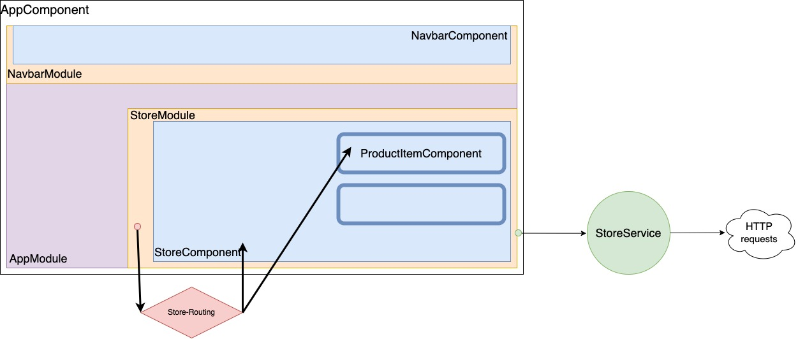

# EShoppingFrontend

This project was generated with [Angular CLI](https://github.com/angular/angular-cli) version 15.0.3.

## Development server

Run `ng serve` for a dev server. Navigate to `http://localhost:4200/`. The application will automatically reload if you
change any of the source files.

## Code scaffolding

Run `ng generate component component-name` to generate a new component. You can also
use `ng generate directive|pipe|service|class|guard|interface|enum|module`.

## Build

Run `ng build` to build the project. The build artifacts will be stored in the `dist/` directory.

## Running unit tests

Run `ng test` to execute the unit tests via [Karma](https://karma-runner.github.io).

## Running end-to-end tests

Run `ng e2e` to execute the end-to-end tests via a platform of your choice. To use this command, you need to first add a
package that implements end-to-end testing capabilities.

## Further help

To get more help on the Angular CLI use `ng help` or go check out
the [Angular CLI Overview and Command Reference](https://angular.io/cli) page.

## Project structure

```
├─ .angular
├─ ...
├─ src
│  ├─ app
│  │  ├─ app-routing.module.ts        (6) File used for navigating between pages. While navigating, we will load its module (and thus its component, using the 'lazy loading'. 
│  │  │                                   We use the tag <router-outlet> for switching between content in our HTML files
│  │  ├─ app.component.html
│  │  ├─ app.component.scss
│  │  ├─ app.component.spec.ts
│  │  ├─ app.component.ts             (4) Our 'AppComponent'. We define methods here for interacting with 'app.component.html' and 'app.component.scss'
│  │  └─ app.module.ts                (3) File listing modules to be preloaded before loading the 'AppComponent'
│  │
│  ├─ assets
│  ├─ index.html                      (5) Main html file loading a 'ap-root' tag. It is a selector, defined in 'app.component.ts'
│  ├─ main.ts                         (2) Main point entry of our App. It will bootstrap our custom module 'AppModule'
│  └─ styles.scss
│
├─ angular.json                       (7) The schema where you define how your Application will be driven. You can define here more custom scss to load for example.
├─ package.json                       (1) The file where we add npm packages for using 3rd party libraries
└─ ...
```

&nbsp;

---

### Component

* When starting the application for the 1st time, you have a single page without routing.

> We can say that **Component** is a graphical portion of our Web page, <ins>where there is an interaction with the User
> and/or the backend server</ins>

```
├─ ...
├─ src
│  ├─ app
│  │  ├─ app.component.html
│  │  ├─ app.component.scss
│  │  ├─ app.component.spec.ts
│  │  ├─ app.component.ts
│  │  └─ app.module.ts 
└─ ...
```


* Then we delete the main content, and we added a **Navbar** component

> The Navbar is placed **on the main component**, like LEGO.

```
├─ ...
├─ src
│  ├─ app
│  │  ├─ navbar
│  │  │  ├─ navbar.component.html
│  │  │  ├─ navbar.component.scss
│  │  │  └─ navbar.component.ts
│  │  │
│  │  └─ ...
└─ ...
```


&nbsp;

---

### Module

When creating different features for our application, we need to **organize** our code files **into different folders**.

> This is what **modules** are for.
>
> You can see we have moved our **Navbar** component into the **core** (module) folder.

```
├─ .angular
├─ ...
├─ src
│  ├─ app
│  │  ├─ core                         # Simple folder, generated with a module.ts, where we will create or move Component folders.
│  │  │  │                            # We have to : IMPORT extarnal Modules into app-module.ts / EXPORT components from these external modules
│  │  │  ├─ navbar
│  │  │  │  └─ ...
│  │  │  │
│  │  │  └─ core.module.ts
│  │  │ 
│  │  └─ ...           
│  │
│  └─ ...
│
└─ ...
```

&nbsp;

---

### Service

When application gets bootstrapped, the **Service** will be injected into the **Module**. In this file, we will
implement the HTTP request methods.

> In the past, we have to declare them into `providers` section of a Module. Now as it is injectable, it will be
> automatically registered into the module and this module will be lazily loaded.

```
├─ .angular
├─ ...
├─ src
│  ├─ app
│  │  ├─ core
│  │  ├─ store
│  │  │  ├─ ...
│  │  │  ├─ store.module.ts
│  │  │  └─ store.service.ts
│  │  └─ ...           
│  └─ ...
└─ ...
```

&nbsp;

---

### Route (and Lazy Loading)

For navigating between pages, we're using defining **Routes**.

> For best **performances**, when bootstrapping the Web application, we should **avoid loading all of our modules** at
> ONCE.
>
> This is where **Lazy Loading** comes into action.

`Store` module is an example of big module :

- When loading its `StoreComponent`, it will send its HTTP requests to the backend to fetch all product data.
- We should only load the module when clicking on the Store URL (`http://localhost:4200/store`).
- In `store-routing.module.ts`, we declare `RouterModule.forChild(routes)`
- In the routing parent `app-routing.module.ts`, we declare alongside `path`, the property `loadChildren`

```
├─ .angular
├─ ...
├─ src
│  ├─ app
│  │  ├─ ...
│  │  ├─ store
│  │  │  ├─ product-details
│  │  │  │  └─ ...
│  │  │  │
│  │  │  ├─ ...
│  │  │  ├─ store.module.ts                   (2) We want to make this module independant => we DON'T EXPORT any components and we import our routing module
│  │  │  └─ store-routing.module.ts           (1) We create the routing file where we define the path to all of its components (store product-details),
│  │  │                                           while importing the 'RouterModule' from Angular. 
│  │  │                                           The RouterModule should be followed by this : RouterModule.forChild(routes)
│  │  │ 
│  │  ├─ app-routing.module.ts                (4) When defining our routes, for the module that have to be loaded on demand, we use the 'loadChildren' property. Like this :
│  │  │                                           {path: 'store', loadChildren: () => import('./store/store.module').then(mod => mod.StoreModule)}
│  │  ├─ app.component.html
│  │  ├─ ...
│  │  └─ app.module.ts                        (3) We DON'T IMPORT the StoreModule. Wew will declare it in our 'app-routing.module.ts'          
│  └─ ...
└─ ...
```

&nbsp;

---

### Summary of Angular web app



&nbsp;

---

### Error Handling

&nbsp;

---

### Pipes and Directives
