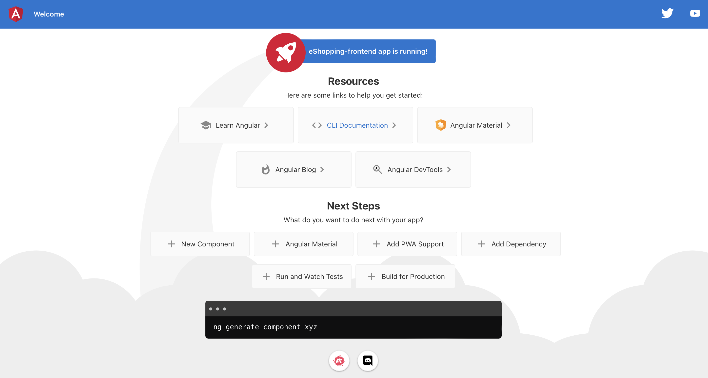
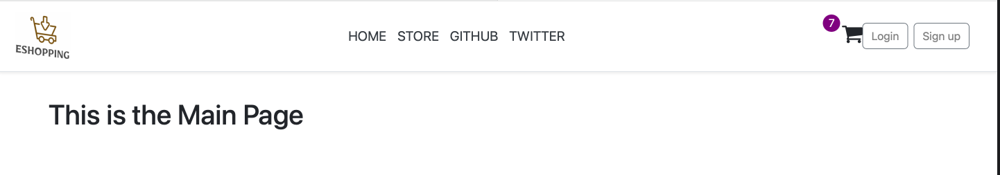

# EShoppingFrontend

This project was generated with [Angular CLI](https://github.com/angular/angular-cli) version 15.0.3.

## Development server

Run `ng serve` for a dev server. Navigate to `http://localhost:4200/`. The application will automatically reload if you
change any of the source files.

## Code scaffolding

Run `ng generate component component-name` to generate a new component. You can also
use `ng generate directive|pipe|service|class|guard|interface|enum|module`.

## Build

Run `ng build` to build the project. The build artifacts will be stored in the `dist/` directory.

## Running unit tests

Run `ng test` to execute the unit tests via [Karma](https://karma-runner.github.io).

## Running end-to-end tests

Run `ng e2e` to execute the end-to-end tests via a platform of your choice. To use this command, you need to first add a
package that implements end-to-end testing capabilities.

## Further help

To get more help on the Angular CLI use `ng help` or go check out
the [Angular CLI Overview and Command Reference](https://angular.io/cli) page.

## Project structure

```
├─ .angular
├─ ...
├─ src
│  ├─ app
│  │  ├─ app-routing.module.ts        (6)
│  │  ├─ app.component.html
│  │  ├─ app.component.scss
│  │  ├─ app.component.spec.ts
│  │  ├─ app.component.ts             (4) Our 'AppComponent'. We define methods here for interacting with 'app.component.html' and 'app.component.scss'
│  │  └─ app.module.ts                (3) File listing modules to be preloaded before loading the 'AppComponent'
│  │
│  ├─ assets
│  ├─ index.html                      (5) Main html file loading a 'ap-root' tag. It is a selector, defined in 'app.component.ts'
│  ├─ main.ts                         (2) Main point entry of our App. It will bootstrap our custom module 'AppModule'
│  └─ styles.scss
│
├─ angular.json                       (7) The schema where you define how your Application will be driven. You can define here more custom scss to load for example.
├─ package.json                       (1) The file where we add npm packages for using 3rd party libraries
└─ ...
```

&nbsp;

### Component

* When starting the application for the 1st time, you have a single page without routing.

> We can say that **Component** is a graphical portion of our Web page, <ins>where there is an interaction with the User
> and/or the backend server</ins>

```
├─ ...
├─ src
│  ├─ app
│  │  ├─ app.component.html
│  │  ├─ app.component.scss
│  │  ├─ app.component.spec.ts
│  │  ├─ app.component.ts
│  │  └─ app.module.ts 
└─ ...
```



* Then we delete the main content, and we added a **Navbar** component

> The Navbar is placed **on the main component**, like LEGO.

```
├─ ...
├─ src
│  ├─ app
│  │  ├─ navbar
│  │  │  ├─ navbar.component.html
│  │  │  ├─ navbar.component.scss
│  │  │  └─ navbar.component.ts
│  │  │
│  │  └─ ...
└─ ...
```



&nbsp;

### FeatModuleure

We divide our Application into dedicated modules.
